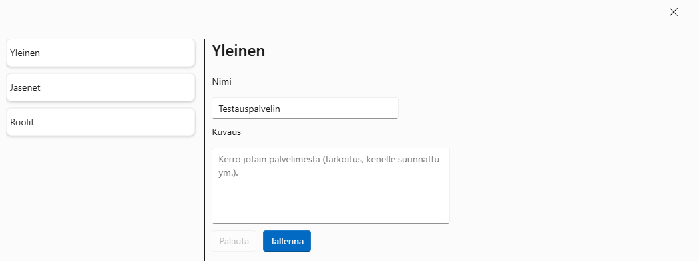

# CommunicationsApp

## Introduction

The goal of this application was to provide similar-ish communications system to Discord with servers and channels.
Real-time communication is made possible with SignalR.

Technologies used:
- ASP.NET Core Identity
- Azure Blob Storage,
- Azure Cosmos DB for NoSQL,
- Blazor,
- Dapper,
- Fluent UI,
- MS SQL Server,
- SignalR.

HybridCache is used to cache user and server info to minimize database calls.

The application functions in the form of servers and channels within the servers. Users can create new servers, or
join existing ones via either a link or code in the link. When users join existing servers, they can choose server-specific
display name and text status.

Each server has default permissions for every member. As long as the member has permission to send messages via default
permissions, or another role, they can send messages in channels (given that the permission for viewing channels is given).
Each message can contain up to 10 attachments that are previewed before sending the message, and then embedded in the server
view (channel).

Server permissions for roles include the ability to kick or ban members. Currently only kicking is implemented.

## Screenshots

While the following screenshots are in Finnish, the application functions in English (en-GB) or aforementioned Finnish (fi-FI).

### Add server modal


In this modal window, the user can choose to create a new server, or join an existing one.

### Create server modal


In this modal window, the user sets the server name and an optional description for a new server.

### Join server modal


In this modal window, the user gives either an invitation link or code to join an existing server.
Below the input for the invitation, example invitations are shown as a reference for the user.

### Set server profile modal


In this modal window, the user can set their display name and text status for the server-specific profile, when
joining an existing server. If the fields are left blank, their values will be taken from the global user profile.
The user is shown the server name they are joining. This modal window is only shown as long as the server exists
from the invitation.

### Message attachment preview


When server members are allowed to send messages, they can attach files as attachments to the message.
The files can be previewed before sending the message.

### Server view


The main view when looking at a server. The server view consists of the channel list on the left, messages sent
in the channel in the middle, and then a server member list that the user can open. The member display name for messages
and the member list is determined by the highest hierarchy role the member has. In this instance of the screenshot, the
member has the permission to view channels.

### Server management view

If the member has permissions to manage the server info, members, or roles, they can open this full-screen dialog. The
default view is determined by their permissions.

#### Server info edit view


In this view, the member can update server name and description. Viewable only if the member has proper server management
permission.

#### Server members view


In this view, the member can view all the members in the server, with the option to kick members. Viewable only
if the member has proper member management permissions.

#### Server info edit view


In this view the member can see all the roles in the server. They can also update the default permissions
that everyone gets or choose a role to edit. Viewable only if the member has proper role management permission.

#### Server info edit view


In this view the member can update role info, permissions and the links between role and members. The editable
info for roles are the name, colour, and boolean if the members with this role are displayed separately in the
member list in server view.

## Running locally

### Development requirements

- [.NET 10 SDK](https://dotnet.microsoft.com/en-us/download/dotnet/10.0)
- [SQL Server](https://learn.microsoft.com/en-us/sql/linux/quickstart-install-connect-docker?view=sql-server-linux-ver16&preserve-view=true&tabs=cli&pivots=cs1-bash#pullandrun2022)
- [Azure Cosmos DB emulator](https://learn.microsoft.com/en-us/azure/cosmos-db/how-to-develop-emulator?tabs=docker-linux%2Ccsharp&pivots=api-nosql)
- [Azurite](https://learn.microsoft.com/en-us/azure/storage/common/storage-use-azurite?tabs=docker-hub%2Cblob-storage)

### Application secrets

The application expects the following variables to be set up:
```
{
  "ConnectionStrings": {
    "DefaultConnection": "<SQL_DB_CONNECTION_STRING>"
  },
  "COSMOSDB_DATABASE": "<COSMOS_DB_NAME>",
  "COSMOSDB_ENDPOINT": "<COSMOS_DB_ENDPOINT>",
  "COSMOSDB_KEY": "<COSMOS_DB_KEY>",
  "COSMOS_DB_CONNECTION_STRING": "<COSMOS_DB_CONNECTION_STRING>",
  "AdminEmail": "<YOUR_EMAIL_FOR_ADMIN>",
  "StorageConnection": "UseDevelopmentStorage=true",
  "StorageConnection:blobServiceUri": "UseDevelopmentStorage=true",
  "StorageConnection:queueServiceUri": "UseDevelopmentStorage=true",
  "StorageConnection:tableServiceUri": "UseDevelopmentStorage=true",
  "BlobStorage": {
    "DefaultConnection": "<YOUR_STORAGE_CONNECTION_STRING>",
    "MessageContainerName": "<YOUR_NAME_FOR_MESSAGE_MEDIA>",
    "AccountName": "<YOUR_ACCOUNT_NAME_FOR_STORAGE>",
    "AccountKey": "<YOUR_ACCOUNT_KEY_FOR_STORAGE>",
  }
}
```

#### Azure Cosmos DB

`AdminEmail` is required for the function of the application (currently you don't need a real email account to register).

If you're using the Cosmos DB Emulator, you're able to use its default values.  
The values being

`localhost:8081` for endpoint,

`C2y6yDjf5/R+ob0N8A7Cgv30VRDJIWEHLM+4QDU5DE2nQ9nDuVTqobD4b8mGGyPMbIZnqyMsEcaGQy67XIw/Jw==` for key, and

`AccountEndpoint=https://localhost:8081/;AccountKey=C2y6yDjf5/R+ob0N8A7Cgv30VRDJIWEHLM+4QDU5DE2nQ9nDuVTqobD4b8mGGyPMbIZnqyMsEcaGQy67XIw/Jw==;` for connection string.

### Azure Blob Storage (Azurite)

For the Azure Blob Storage, you should follow these [instructions](https://learn.microsoft.com/en-us/azure/storage/common/storage-use-azurite?tabs=docker-hub%2Cblob-storage) to use Azurite for local development.

For using Azurite with HTTPS, you need to create certificates. You can follow [this](https://github.com/Azure/Azurite/blob/main/README.md#https-setup), or follow these two steps:

1) Install mkcert
```
choco install mkcert
```
2) Run these commands
```
mkcert -install
mkcert 127.0.0.1
```

If you use the Docker method, you can use this command to create a container:
```
docker run --name azurite -p 10000:10000 -p 10001:10001 -p 10002:10002 -v c:/azurite:/workspace  mcr.microsoft.com/azure-storage/azurite azurite --oauth basic --blobHost 0.0.0.0  --queueHost 0.0.0.0 --tableHost 0.0.0.0 --cert /workspace/127.0.0.1.pem --key /workspace/127.0.0.1-key.pem
```

Before running the project, make sure to have a container for whatever you choose for `MessageContainerName`. You can use the
[Azure Storage Explorer](https://azure.microsoft.com/en-us/products/storage/storage-explorer/?msockid=39d082cbe9d16be9142194d6e8ba6acb#Download-4) to create the container. Make sure to also set the public read access
level to at least the blobs.

#### Secrets

The default connection string for the storage service would be this one:
```
DefaultEndpointsProtocol=https;AccountName=devstoreaccount1;AccountKey=Eby8vdM02xNOcqFlqUwJPLlmEtlCDXJ1OUzFT50uSRZ6IFsuFq2UVErCz4I6tq/K1SZFPTOtr/KBHBeksoGMGw==;BlobEndpoint=https://127.0.0.1:10000/devstoreaccount1;QueueEndpoint=https://127.0.0.1:10001/devstoreaccount1;TableEndpoint=https://127.0.0.1:10002/devstoreaccount1;
```

### SQL Server

For the SQL Server database, you need to run the migration(s) first. You can do this with the `Update-Database`
command if you're using the VS Package Manager Console, or `dotnet ef database update` if you're using the CLI.